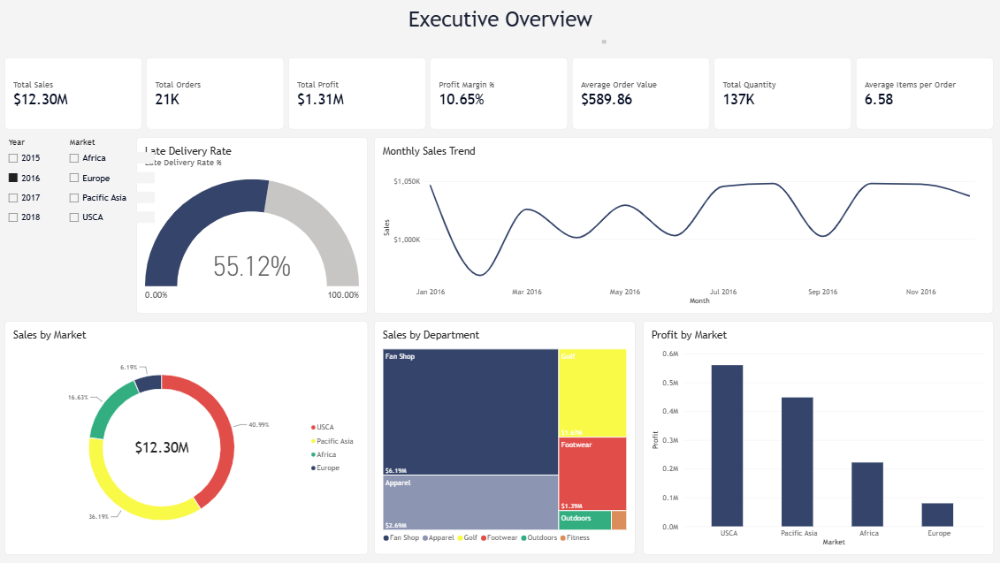
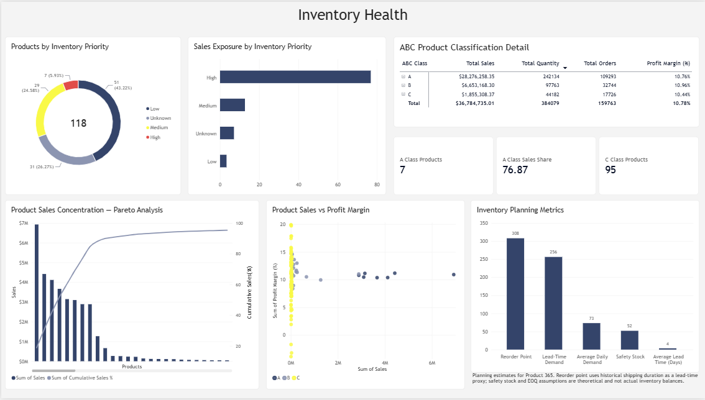
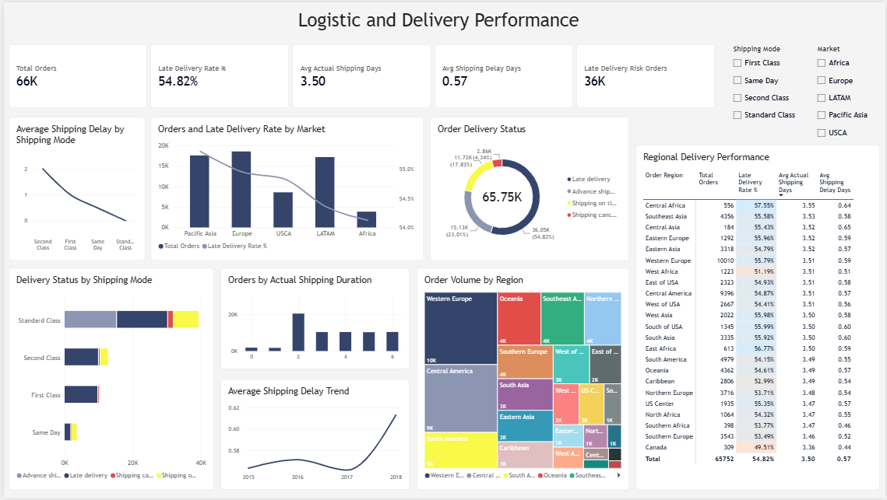
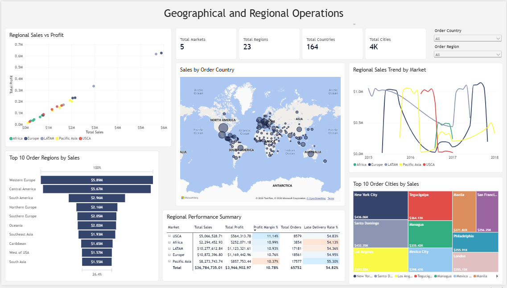

# DataCo Smart Supply Chain Analytics
### Demand Forecasting, Inventory Planning & Business Performance | Python, SQL & Power BI
 


 
## Table of Contents
- [Overview](#overview)
- [Tools](#tools)
- [Dataset](#dataset)
- [Data Quality & Cleaning](#data-quality--cleaning)
- [Feature Engineering](#feature-engineering)
- [How to Run](#how-to-run)
- [Key Metrics](#key-metrics)
- [Sales Trend Analysis](#sales-trend-analysis)
- [Market & Regional Analysis](#market--regional-analysis)
- [Delivery & Logistics](#delivery--logistics)
- [Customer Analysis](#customer-analysis)
- [Category & Product Analysis](#category--product-analysis)
- [Demand Forecasting (Product 365)](#demand-forecasting-product-365)
- [ABC Classification & Demand Variability](#abc-classification--demand-variability)
- [Inventory Planning](#inventory-planning)
- [SQL Analysis](#sql-analysis)
- [Power BI Dashboard](#power-bi-dashboard)
- [Dashboard-Only Insights](#dashboard-only-insights)
- [Key Business Insights](#key-business-insights)
- [Limitations](#limitations)
- [Skills Demonstrated](#skills-demonstrated)
- [Project Structure](#project-structure)
- [Author](#author)

## Overview
This project analyzes the DataCo Smart Supply Chain dataset — 180,519 order-item records spanning January 2015 to January 2018 — to understand business performance, delivery and logistics patterns, customer behavior, product concentration, demand forecasting, and inventory planning.
 
Python was used for data cleaning, feature engineering, exploratory analysis, demand forecasting, and inventory optimization. MySQL was used to build a relational data model and run business-analysis queries, including SQL-only versions of the ABC classification and inventory priority logic. Power BI was used to build an interactive dashboard on top of both.
 
## Tools
- **Python** (Pandas, NumPy, Matplotlib) — cleaning, EDA, forecasting, inventory planning
- **SQL** (MySQL) — relational schema, business queries, recursive-CTE inventory analysis
- **Power BI** (DAX) — interactive dashboard
## Dataset
Source: [DataCo Smart Supply Chain for Big Data Analysis](https://www.kaggle.com/datasets/shashwatwork/dataco-smart-supply-chain-for-big-data-analysis) (Kaggle), originally published by Constante, Silva & Pereira via [Mendeley Data](https://data.mendeley.com/datasets/8gx2fvg2k6) (DOI: 10.17632/8gx2fvg2k6).
>Download the dataset from the Kaggle link above and place it in `Datasets/raw/`
- **180,519 rows**, 53 columns, at the **order-item level** (not the order level)
- **65,752 unique orders**, 180,519 unique order-item IDs
- **0 duplicate full rows**
- Order dates: 1 Jan 2015 – 31 Jan 2018
- Shipping dates: 3 Jan 2015 – 6 Feb 2018
 
The dataset does **not** include actual warehouse inventory snapshots or supplier records — this is addressed directly in [Limitations](#limitations).
 
## Data Quality & Cleaning
 
**Missing values found:**
 
| Column | Missing |
|---|---:|
| Product Description | 180,519 (100%) |
| Order Zipcode | 155,679 (86.24%) |
| Customer Lname | 8 |
| Customer Zipcode | 3 |
 
**Integrity checks performed:**
- No duplicate order-item IDs or full records
- `Customer Id` and `Order Customer Id` consistent
- `Product Card Id` and `Order Item Cardprod Id` consistent
- No conflicting product names/categories/departments/prices
- Order-level fields (market, region, city, state, country) checked for internal consistency
**Cleaning decisions:**
- Dropped: `Product Description`, `Customer Password`, `Customer Email`, `Product Image`, `Order Zipcode`, `Order Customer Id`, `Order Item Cardprod Id`
- Kept the 8 missing `Customer Lname` values blank (not relevant to analysis)
- Replaced missing `Customer Zipcode` with `"Unknown"`
- Final cleaned dataset retains all 180,519 records
## Feature Engineering
 
**Date features:** Order Year, Order Month, Order Month Name, Order Quarter, Order Day, Order Day of Week, Order Day of Week Number, Order Year-Month, Order Date
 
**Logistics:** Shipping Delay Days (actual vs. scheduled shipping time)
 
**Profitability:** Profit Margin % = `Benefit per Order / Sales × 100`
 
These fields are used consistently across the Python, SQL, and Power BI layers.
 
## How to Run
1. Clone the repository and install dependencies:
```bash
   pip install -r requirements.txt
```
2. Run the analysis notebook (`Notebooks/PythonAnalysis.ipynb`) to clean the raw data, engineer features, and export the processed CSVs to `Datasets/processed/`.
3. Create the MySQL database and load the data:
```bash
   mysql -u <user> -p < SQL/01_create_tables.sql
   mysql -u <user> -p --local-infile=1 < SQL/02_load_data.sql
```
   (Update the file paths inside `02_load_data.sql` to match your local `Datasets/processed/` folder first.)
4. Run the analysis queries in `SQL/03_analysis_queries.sql`.
5. Open `PowerBi/DataCo Supply Chain Dashboard.pbix` in Power BI Desktop.
 
## Key Metrics
 
| Metric | Value |
|---|---:|
| Total Sales | $36,784,735.01 |
| Total Orders | 65,752 |
| Total Quantity | 384,079 |
| Total Profit | $3,966,902.97 |
| Average Order Value | $559.45 |
| Average Quantity per Order | 5.84 |
| Overall Profit Margin | 10.78% |
 
## Sales Trend Analysis
 
| Year | Sales | Profit | Orders |
|---|---:|---:|---:|
| 2015 | ~$12.34M | ~$1.319M | 20,904 |
| 2016 | ~$12.30M | ~$1.310M | 20,859 |
| 2017 | ~$11.81M | ~$1.304M | 21,866 |
| 2018 | ~$0.332M | ~$0.034M | 2,123 |
 
**Year-over-year change:** 2016 ≈ -0.30%, 2017 ≈ -4.03%, 2018 ≈ -97.19%
 
The 2018 figure only reflects January 2018 and should not be read as a business collapse. There is also a data-coverage issue in late 2017 — some markets disappear from the dataset in that period, so the apparent decline should be treated cautiously rather than as confirmed business deterioration until coverage is fully mapped.
 
**Monthly/seasonal patterns:** Monthly sales are remarkably stable (~$1.0–1.1M/month) for most of the dataset's range. The **top 10 months by sales are dominated by mid-to-late 2017** (September 2017 is the single highest month, ~$1.14M), while the **bottom months are November–December 2017 and January 2018** — a drop that lines up with the market/region coverage gaps described below, not necessarily a genuine demand collapse.
 
## Market & Regional Analysis
Markets covered: **Africa, Europe, LATAM, Pacific Asia, USCA.**
 
A 2016 vs. 2017 comparison was run specifically for November–December, since this is where the dataset's coverage becomes uneven:
- **Europe and Pacific Asia** are the only markets with data in both November/December 2016 *and* 2017, showing genuine growth (Europe Nov: +3.58%; Pacific Asia Nov: +36.06%, Dec: +53.39%).
- **Africa and USCA have no records at all in Nov/Dec 2017** (only 2016), confirmed by a direct row-count coverage check across Oct–Dec — e.g. Africa has 2,383–2,476 records/month in Oct–Dec 2016 but zero in Nov/Dec 2017.
- Region-level detail shows the same pattern (e.g. several African sub-regions have 2016 data with no matching 2017 rows).
**Conclusion:** the apparent late-2017 "decline" reported in the yearly/monthly trend is very likely a **data coverage artifact** (missing markets), not a real drop in business — this was correctly treated as missing rather than zero throughout the analysis.
 
## Delivery & Logistics
 
**Delivery status:**
 
| Status | Orders |
|---|---:|
| Late delivery | 98,977 |
| Advance shipping | 41,592 |
| Shipping on time | 32,196 |
| Shipping canceled | 7,754 |
 
**Late delivery risk:**
 
| Risk | Orders |
|---|---:|
| Risk | 98,977 |
| No Risk | 81,542 |
 
**Shipping mode:**
 
| Mode | Orders |
|---|---:|
| Standard Class | 107,752 |
| Second Class | 35,216 |
| First Class | 27,814 |
| Same Day | 9,737 |
 
## Customer Analysis
 
**Customer segments by order volume:**
 
| Segment | Orders |
|---|---:|
| Consumer | 93,504 |
| Corporate | 54,789 |
| Home Office | 32,226 |
 
Customer-level analysis (beyond segment averages) covered: top customers by sales, most frequent customers, highest-AOV customers, high-value customers, high-return customers, and the intersection of high-value + high-return customers — moving from segment-level averages to individual customer behavior.
 
> Note: this project does not currently include RFM segmentation. If you want to add it, it needs to be built and verified against this dataset specifically — do not reuse RFM figures from another project.
 
## Category & Product Analysis
 
**Top categories by sales:**
 
| Category | Sales | Profit | Quantity | Orders | Profit Margin |
|---|---:|---:|---:|---:|---:|
| Fishing | $6,929,653.69 | $756,220.77 | 17,325 | 15,164 | 10.91% |
| Cleats | $4,431,942.78 | $494,636.92 | 73,734 | 20,386 | 11.16% |
| Camping & Hiking | $4,118,425.57 | $427,455.57 | 13,729 | 12,299 | 10.38% |
| Cardio Equipment | $3,694,843.20 | $383,011.10 | 37,587 | 11,355 | 10.37% |
| Women's Apparel | $3,147,800.00 | $350,421.03 | 62,956 | 17,869 | 11.13% |
| Water Sports | $3,113,844.68 | $325,146.96 | 15,540 | 13,758 | 10.44% |
| Men's Footwear | $2,891,757.66 | $311,902.82 | 22,246 | 18,783 | 10.79% |
| Indoor/Outdoor Games | $2,888,993.91 | $318,451.43 | 57,803 | 16,623 | 11.02% |
 
**Fishing is the single highest-revenue category**, though profit margins are fairly consistent (~10–11%) across all major categories — no category stands out as dramatically more or less profitable, which is itself worth noting as a finding (revenue concentration is driven by volume/price, not margin differences).
 
**ABC product classification** (cumulative sales contribution: A ≤ 80%, B = 80–95%, C = 95–100%):
 
| ABC Class | Products | Sales | Sales Share |
|---|---:|---:|---:|
| A | 7 | $28,276,258.35 | 76.87% |
| B | 16 | $6,653,168.30 | 18.09% |
| C | 95 | $1,855,308.37 | 5.04% |
 
**The 7 A-class products** (with the single highest, "Field & Stream Sportsman 16 Gun Fire Safe," alone contributing 18.84% of total sales) drive over three-quarters of revenue — a very concentrated product base.
 
**Lowest-margin products:** several products actually run at a **loss**, most notably the "Bushnell Pro X7 Jolt Slope Rangefinder" (-3.88% margin) and "SOLE E35 Elliptical" (-3.22% margin) — both C-class products, meaning they're low-revenue *and* unprofitable, making them clear candidates for pricing review or discontinuation.
 
 
## Demand Forecasting (Product 365)
Product Card Id 365 was selected for detailed demand forecasting.
 
| Model | MAE | RMSE | MAPE |
|---|---:|---:|---:|
| 3-Month Moving Average | 130.11 | 159.61 | 6.14% |
| SES (α = 0.3) | 108.38 | 148.47 | 5.27% |
| SES (α = 0.5) | 104.53 | 139.34 | 5.04% |
 
**Selected model:** SES with α = 0.5, producing a forecast of approximately **2,252 units/month**, applied across October 2017 – March 2018.
 
This is presented as a baseline demand-forecasting exercise appropriate to the available historical data — not a sophisticated ML prediction — and daily demand for this exercise was calculated including zero-demand days for accuracy.
 
## ABC Classification & Demand Variability
 
Products were ranked by cumulative sales contribution:
- **A: first 80%** of cumulative sales
- **B: next 15%**
- **C: remaining 5%**
**Result:** 7 A-products, 16 B-products, 95 C-products. The 7 A-products represent approximately **76.87% of total sales**.
 
Demand variability was measured via coefficient of variation (CV = std / mean of monthly demand):
- Low: CV < 0.20
- Medium: 0.20 ≤ CV < 0.50
- High: CV ≥ 0.50
**Combined ABC × Variability → Inventory Priority:**
 
| Priority | Products | Sales | Sales Share |
|---|---:|---:|---:|
| High | 7 | $28.28M | 76.87% |
| Medium | 29 | $4.68M | 12.71% |
| Low | 51 | $1.22M | 3.32% |
| Unknown | 31 | $2.61M | 7.10% |
 
The takeaway: inventory attention should combine **sales importance** with **demand variability**, not sales volume alone.
 
## Inventory Planning
 
Example built for Product 365, using a 95% service level (Z = 1.645):
 
| Metric | Value |
|---|---:|
| Average Daily Demand | 73.28 units |
| Average Lead Time | 3.50 days |
| Lead-Time Demand | 256.33 units |
| Safety Stock | ~52 units |
| Reorder Point | ~308 units |
 
**EOQ:** calculated using an assumed ordering cost (S = 500) and holding cost (H = 50), since the dataset has no actual cost data — `EOQ = √(2DS/H)`. These are documented assumptions, not values sourced from the dataset.
 
## SQL Analysis
The relational model:
```
customers ──< orders ──< order_items >── products
```
39 analytical queries were run against this schema, grouped by theme: business KPIs, time-series trends, market/regional performance, customer behavior, product performance, category/segment analysis, logistics, and profitability. Core totals match the Python notebook exactly (e.g. total sales $36,784,734.31 in SQL vs. $36,784,735.01 in Python — a $0.70 rounding difference across 180K rows).
 
ABC classification, demand variability, and inventory planning are **not** replicated in SQL — that logic stays in Python, where the statistical work (coefficient of variation, safety stock formulas) is a more natural fit.
 
**A few standout SQL findings beyond what the notebook covers:**
- **"First Class" shipping has the *worst* late-delivery rate (95.27%)**, far above Standard Class (38.13%) — counterintuitive at first, but explained by the scheduling data: First Class orders are scheduled for just 1 day, so almost any real-world variance (avg. actual: 2 days) tips them into "late," while Standard Class is scheduled more realistically (4 days) and mostly hits it. This is a genuinely useful operational insight the Python analysis doesn't surface.
- **12 cities combine high sales volume (300+ orders) with a high late-delivery rate (≥55%)**, led by New York City ($436K sales, 56.06% late) and Santo Domingo ($432K sales, 55.38% late) — a practical shortlist for logistics investigation.
- **Customer segment barely predicts loyalty or spend**: repeat-purchase rate is essentially flat across Consumer/Corporate/Home Office (56.6–57.2%), and sales-per-customer is similarly close ($1,754–$1,790) — segment alone isn't a strong lever for retention targeting on this dataset.
- **The lowest-margin products list matches exactly between SQL and Python** (Bushnell Pro X7 Jolt Slope Rangefinder at -3.88%, SOLE E35 Elliptical at -3.22%, down to the cent on total sales/profit) — a useful cross-validation that both pipelines are computing profitability the same way.
- Full theme breakdown: business KPIs, time-series trends, market/regional performance, customer segmentation and repeat-purchase behavior, product/category performance, city-level and shipping-mode logistics, and profitability by delivery-risk status.
## Power BI Dashboard
Data model:
```
customers → orders → order_items ← products
```
 
**Five pages:**
1. **Executive Overview** — headline KPIs, monthly sales trend, sales/profit by market, sales by department, late-delivery-rate gauge
2. **Demand and Forecast** — monthly demand trend, demand mix by customer segment, top products by demand, Product 365 planning estimates, actual-vs-forecast chart, forecast model accuracy (MAPE)
3. **Inventory Health** — inventory priority breakdown, sales exposure by priority, ABC classification detail, Pareto concentration chart, sales-vs-margin scatter, Product 365 inventory planning metrics
4. **Logistic and Delivery Performance** — delivery status breakdown, late delivery by shipping mode and market, regional delivery performance table, shipping delay trend
5. **Geographical and Regional Operations** — regional sales vs. profit, top order regions/cities by sales, regional performance summary table, regional sales trend by market
DAX measures include: Total Sales, Total Profit, Total Quantity, Total Orders, Total Customers, Average Order Value, Profit Margin %, Average Items per Order, Late Delivery Rate %, Late Delivery Risk Orders, Average Actual Shipping Days, Average Shipping Delay Days.
 






 
## Dashboard-Only Insights
A few findings only visible once the data was visualized in Power BI — not surfaced in the Python or SQL analysis:
 
- **Profit margin varies by market, and it lines up with delivery performance**: USCA has the highest margin (11.14%) and the second-best late-delivery rate; **Pacific Asia has both the lowest margin (10.37%) and the worst late-delivery rate (55.30%)** among the five markets. Worth investigating whether delivery issues in Pacific Asia are eating into margin (e.g. compensation, expedited re-shipping) or whether it's a coincidence of product mix.
- **Shipping delay is trending worse over time**: the Average Shipping Delay Trend chart shows delay creeping up from ~0.58 days (2015–2016) to ~0.62 days by 2018 — a slow but steady degradation in fulfillment performance, not visible in any single-year snapshot.
- **Central Africa has the single worst regional late-delivery rate at 57.55%**, higher than any other of the 23 regions in the dataset — more granular than the market-level Africa figure (54.13%) and a better target for operational drill-down.
- **Canada has the dataset's best regional delivery performance** (49.51% late-delivery rate, the only region under 50%), worth understanding as a potential best-practice case.
## Key Business Insights
- **Revenue is highly concentrated**: 7 A-class products generate ~76.87% of total sales, led by a single product ("Field & Stream Sportsman 16 Gun Fire Safe") contributing 18.84% alone — availability of these products is a critical operational priority.
- **Fishing is the top revenue category** ($6.93M), but profit margins are consistent (~10–11%) across all major categories — the concentration comes from volume/price, not margin differences.
- **Some products are unprofitable outright** — several low-margin C-class products (e.g. the Bushnell Pro X7 Jolt Slope Rangefinder, SOLE E35 Elliptical) run negative margins, making them candidates for pricing review or discontinuation rather than just "low priority."
- **Delivery performance is a major operational issue**: 98,977 orders (more than half) carry late-delivery risk — logistics deserves to be a headline dashboard page, not an afterthought.
- **The apparent late-2017 sales decline is a data-coverage artifact, not a real drop**: Africa and USCA simply have no records in Nov/Dec 2017 (confirmed via row-count coverage checks), while markets with full coverage (Europe, Pacific Asia) actually show growth in that period.
- **Demand variability matters as much as sales volume for inventory decisions** — ABC classification alone under-prioritizes high-value, high-variability products; most A-class products (including Product 365) fortunately show Low variability, but this isn't guaranteed across the catalog and should be checked before assuming all A-products are equally easy to plan for.
- **Product 365's baseline forecast (SES, α = 0.5, MAPE ≈ 5.04%)** is usable for near-term planning, though it can't capture trend or seasonality — a documented limitation of the method.
- **Shipping mode has a counterintuitive delivery-risk pattern**: First Class (fastest) has the *highest* late-delivery rate (95.27%) because it's scheduled far more tightly than Standard Class — a scheduling-design issue as much as a fulfillment one.
## Limitations
- The dataset has **no actual warehouse inventory or supplier records**. Safety stock, reorder point, EOQ, and days-of-inventory figures throughout this project are **planning estimates derived from historical demand and shipping-time data**, not measured stock levels.
- Some markets/regions have missing observations in late 2017, which affects the reliability of late-2017 trend comparisons.
- Demand forecasting was demonstrated on a single product (365) as a methodology case study rather than scaled across the full catalog.
## Skills Demonstrated
| Area | Technique |
|---|---|
| Data Quality | Missing-value audit, integrity checks, documented cleaning decisions |
| Feature Engineering | Date decomposition, shipping-delay and margin calculations |
| Forecasting | Moving average, simple exponential smoothing, MAE/RMSE/MAPE evaluation |
| Inventory Theory | ABC classification, coefficient of variation, safety stock, reorder point, EOQ |
| SQL | Relational schema design, window functions, recursive CTEs, business-question-driven queries |
| BI Development | DAX measures, drill-through, relational data modeling |
 
## Project Structure
```text
DataCo-Supply-Chain-Analytics/
│
├── Datasets/
│   ├── raw/
│   └── processed/
│
├── SQL/
│   ├── 01_create_tables.sql
│   ├── 02_load_data.sql
│   └── 03_analysis_queries.sql
│
├── Notebooks/
│   └── PythonAnalysis.ipynb
│
├── PowerBi/
│   └── DataCo Supply Chain Dashboard.pbix
│
├── Assets/
│   └── (dashboard screenshots)
│
├── README.md
├── requirements.txt
└── .gitignore

```
 
## Author
**Rashi Patni**